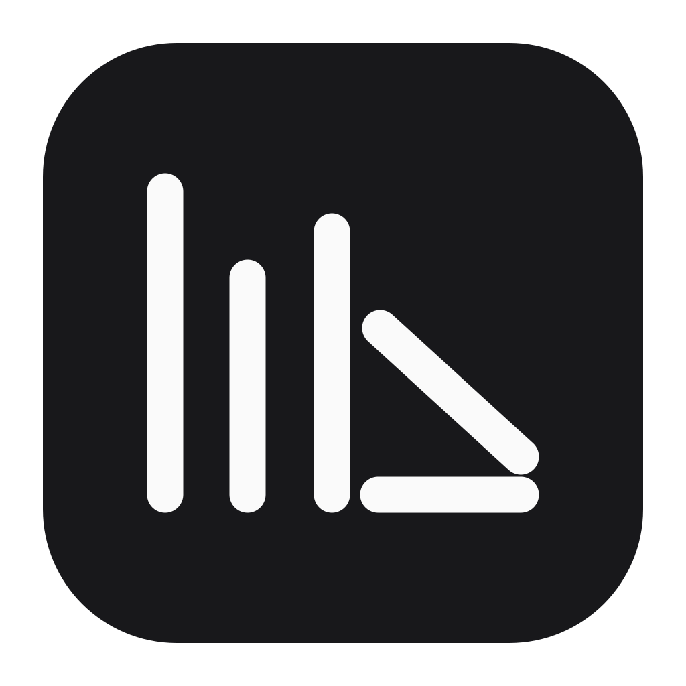
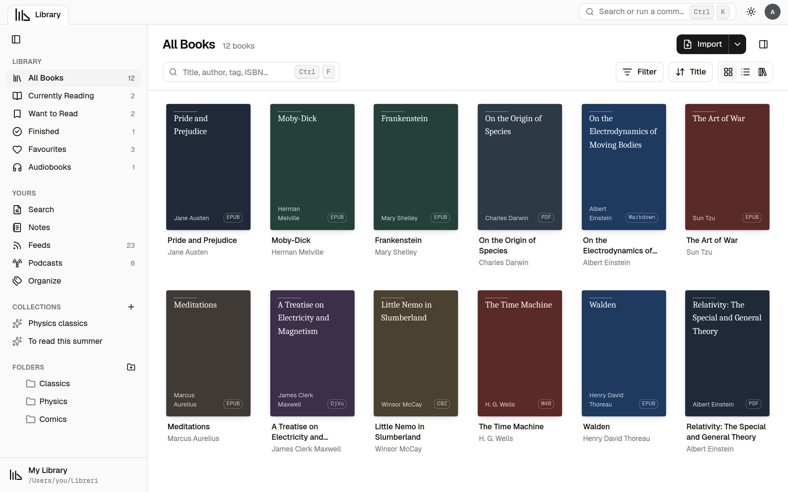
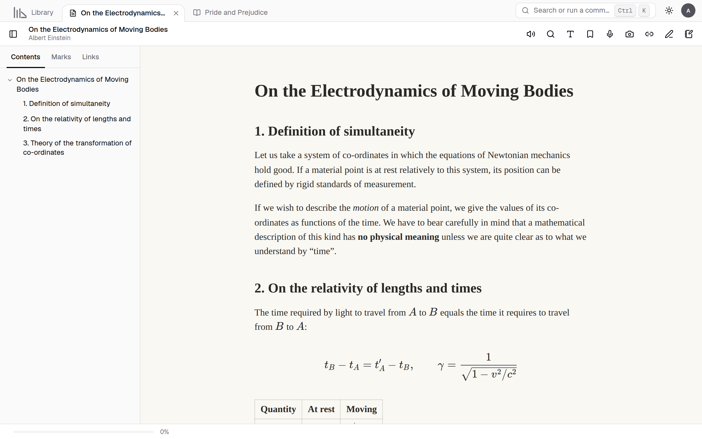
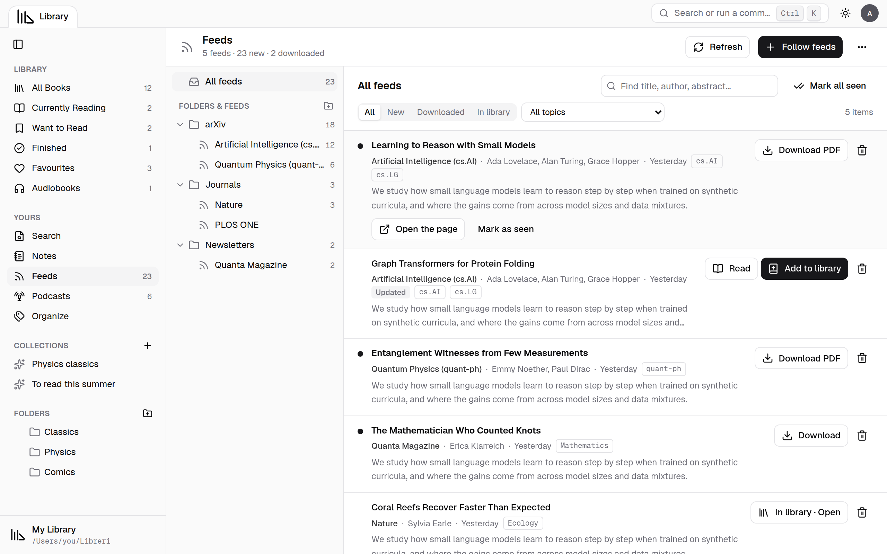
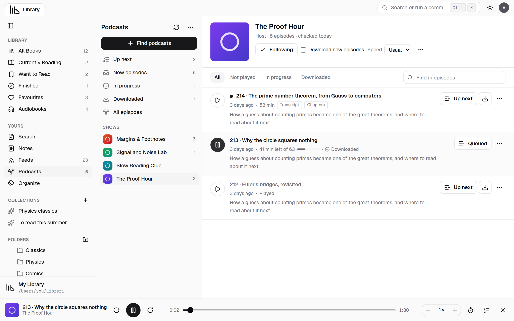
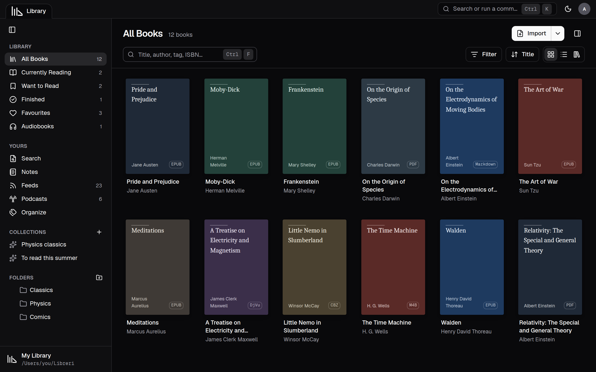

<div align="center">



# Libreri

**Your books, papers, comics, audiobooks and podcasts, in one calm place.**<br>
Read, highlight, write notes by hand or by voice, and listen, all on your own computer.


<br>


[Features](#features) · [Screenshots](#screenshots) · [Formats](#formats) · [Your library on disk](#your-library-on-disk) · [Run it](#run-it) · [Docs](#documentation)

<br>

<picture>
  <source media="(prefers-color-scheme: dark)" srcset="assets/screenshots/library-dark.png">
  
</picture>

</div>

> [!NOTE]
> **Status:** Phases 0–9 are built, and Phase 10 (polish and release) is under way. Version 2 will bring iPhone, iPad and Android apps that sync over your home network, printing and sharing, and AI research tools. See the [development phases](docs/development-phases.md).

## Why Libreri

<table>
<tr>
<td width="33%" valign="top">

### Yours, on disk

Your library is an ordinary folder. Books stay as plain files and notes are Markdown. Move it, sync it or back it up like any other folder: every link still works.

</td>
<td width="33%" valign="top">

### Private by default

Nothing leaves your computer unless you ask. Online lookups, feeds, podcasts and model downloads are opt-in, and the speech, voice, OCR and maths models run on your computer.

</td>
<td width="33%" valign="top">

### Made for study

Highlights that link back to the page, a notebook per book, handwriting, paper notes from your phone, maths as LaTeX, and full-text search across everything.

</td>
</tr>
</table>

## Screenshots

<table>
<tr>
<td width="50%"><br><sub><b>Reading</b>: KaTeX maths, contents, page themes, read aloud and notes</sub></td>
<td width="50%"><br><sub><b>Feeds</b>: arXiv, journals and newsletters, downloaded and added to the library</sub></td>
</tr>
<tr>
<td width="50%"><br><sub><b>Podcasts</b>: follow shows, keep your place, listen while you read</sub></td>
<td width="50%"><br><sub><b>Dark theme</b>: the whole app, plus nine page themes for books</sub></td>
</tr>
</table>

## Features

<table>
<tr>
<td width="50%" valign="top">

#### Library

- **Drag in** files and whole folders. Duplicates are caught by content, and moved files are found again.
- **Real folders**, plus tags, categories, series, ratings, reading status and favourites.
- **Grid, list and shelf** views, filters, **smart collections** and bulk edit.
- **Online details** by ISBN, DOI, arXiv id or title from eight sources, with covers and **barcode scanning**.
- **Full-text search** inside every book, with **OCR** for scans: Tesseract, or an optional PaddleOCR-VL download that also reads tables and formulas.
- Health check, PDF version history and automatic **backups**.

</td>
<td width="50%" valign="top">

#### Reading

- **Tabs**, split view and separate windows, remembered between launches.
- **9 page themes**, dark PDFs, brightness, contrast, text size and spacing.
- **Full screen**, focus mode, two-page spreads, manga and webtoon modes.
- **Zoom** with buttons, Ctrl+scroll or a two-finger pinch, and **print** PDFs (all pages, the page shown or a range).
- Works in **narrow windows** down to a third of the screen; side panels slide over the page.
- **ADHD reading:** bionic reading, a line highlight and a reading mask.
- **Find in book**, contents, bookmarks, and your place kept per profile.
- A **study timer** (focus sessions, countdown, stopwatch) that also shows in the menu bar or taskbar, and a **reading calendar** (month, week and day) with goals, due dates, streaks and .ics export.
- **Compare** two versions or two PDFs side by side.

</td>
</tr>
<tr>
<td valign="top">

#### Notes

- **Highlights** in four colours, **comments**, and a **Markdown notebook** per book.
- **Markup** on PDF and comic pages: pen, shapes, stamps, signatures and a measure tool.
- **Handwriting canvases** beside the book, with *clip from page* and *ink to text*.
- **Paper notes** from the camera or your phone, cleaned and made searchable.
- **Voice notes** and **dictation**, written down on your computer.
- **Maths as LaTeX**, from text or from a picture of the page.
- A **Notes hub** across books, exported to Markdown and Obsidian.

</td>
<td valign="top">

#### Listening

- **Read aloud** with sentence highlighting, page turning and maths read as words, in the system's voices or **natural voices** made on your computer: **Kokoro** (54 voices in nine languages) and **Piper** (40+ languages, only voices free to use).
- **Audiobooks** with chapters, sleep timer, bookmarks and media keys.
- **Link an audiobook to its ebook:** the book follows the audio.
- **Podcasts:** search Apple Podcasts (or Podcast Index with your own key), follow shows, stream or download episodes, **Up next**, per-show speed, and a player that keeps going while you read.
- One **floating player** for read aloud, audiobooks and podcasts, which folds into a small box you can move to either side.

</td>
</tr>
<tr>
<td valign="top">

#### Feeds

- Follow **RSS and Atom**: arXiv categories and searches, journals, newsletters and blogs, or import OPML.
- Feeds in **folders**, items filtered by topic.
- **Download** papers (PDF) and articles (a clean Markdown copy), and **read them in the full reader** with themes, ADHD reading, read aloud and maths.
- **Add to library** moves a download in with the feed's details (authors, abstract, DOI, arXiv id, categories, journal), and looks up the rest online.
- **Share** a paper: copy its link, a citation (BibTeX) or a Markdown link, or email it.

</td>
<td valign="top">

#### PDF editing

- **Pages:** reorder, rotate, delete, insert, crop, extract, split and merge.
- **Redaction** that really removes the text, **text corrections** and **forms**.
- Compression, and OCR text written into the PDF.
- Every save keeps the previous **version**, with your notes moved to the right pages.

</td>
</tr>
<tr>
<td valign="top">

#### People and privacy

- **Profiles** with 6-digit PINs, auto-lock, Kids profiles and guests who leave nothing behind.
- Everyone keeps their own notes, places, collections, feeds and podcasts.

</td>
<td valign="top">

#### Keyboard and portability

- **100+ rebindable shortcuts**, a command palette (Ctrl+K) and optional Vim keys.
- **Spell check** in 45+ languages, and word completion that learns from your books.
- **Export** to Libreri archives, CSV, Excel, JSON, BibTeX, RIS, CSL-JSON, Obsidian and Calibre; **import** from Calibre, Zotero, Mendeley, Goodreads and StoryGraph.

</td>
</tr>
</table>

## Formats

| | Formats |
|---|---|
| **Documents** | PDF (with forms), DjVu |
| **Ebooks** | EPUB, MOBI, AZW3, FB2 (DRM-free) |
| **Text** | Markdown (KaTeX maths, Mermaid, code), RTF, plain text |
| **Comics** | CBZ, CBR, CB7, CBT, CBA |
| **Audio** | MP3, M4B, M4A, AAC, OGG, Opus, FLAC, and podcasts |

Some formats use **helper programs** that Libreri installs for you with one click (Homebrew, winget, apt, dnf, pacman or zypper):

| Helper | Used for |
|---|---|
| DjVuLibre | DjVu books |
| Tesseract | OCR, searchable scans, ink to text on Linux |
| unar | CBR, CB7 and CBA comics |
| eSpeak NG | Read aloud where the system has no voices; turns words into sounds for natural voices |

Optional **downloads**, all run on your computer, each with its own Delete button: natural voices for read aloud (Kokoro and Piper, with ONNX Runtime), speech models (whisper.cpp) for voice notes and dictation, the PaddleOCR-VL model, the pix2tex maths model, spell-check dictionaries, OCR languages and extra canvas fonts.

## Your library on disk

```
My Library/
├── Books/              your books and audiobooks, in your own folders
├── Notes/<profile>/    notebooks, canvases, voice notes, paper notes, web pages
├── Feeds/<profile>/    papers, articles and podcast episodes you downloaded
└── .library-data/      Libreri's catalogue, covers, sidecars and versions
```

Only relative paths are stored, so a library can be moved, synced or opened on another computer. The catalogue can be rebuilt from the files and the JSON sidecars at any time. See [data portability](docs/data-portability.md).

## Run it

**You need**

- [Rust](https://rustup.rs) via rustup. The right version (1.95) is installed automatically from `rust-toolchain.toml`.
- [Node.js](https://nodejs.org) 20+ and [pnpm](https://pnpm.io) 10 (`corepack enable`).
- Tauri's [platform prerequisites](https://v2.tauri.app/start/prerequisites/):
  - **macOS** 13.3 or newer: Xcode Command Line Tools (`xcode-select --install`).
  - **Linux:** `libwebkit2gtk-4.1-dev libgtk-3-dev libayatana-appindicator3-dev librsvg2-dev`.
  - **Windows:** Microsoft C++ Build Tools and WebView2 (included with Windows 11).

**Start**

```sh
pnpm install
pnpm dev          # the app with hot reload
```

The development build is much slower than the finished app. To judge speed, build it:

```sh
pnpm build        # installers in target/release/bundle/
```

<details>
<summary><b>Other commands</b></summary>
<br>

| Command | What it does |
|---|---|
| `pnpm test` | Frontend tests (Vitest) and Rust tests |
| `pnpm lint` | ESLint, TypeScript and Clippy |
| `pnpm format` | Prettier and rustfmt |
| `pnpm gen:ipc` | Regenerates the TypeScript types from the Rust commands |
| `pnpm icons` | Regenerates the app icons from `assets/app-icon.png` |
| `cargo run -p libreri-library --release --example seed -- <books> <library>` | Makes a library from a folder of books, for trying things out |
| `cargo run -p libreri-feeds --example live [addresses…]` | Reads feeds on the internet, to check the feed reader |

</details>

<details>
<summary><b>How the code is organised</b></summary>
<br>

```
apps/desktop/src          React interface, one folder per feature (features/*); readers/ holds the book renderers
apps/desktop/src-tauri    Thin Tauri shell: commands, events, the book:// protocol

crates/libreri-core       Domain types, ids and the library layout (no app dependencies)
crates/libreri-db         SQLite and migrations
crates/libreri-library    Library folders: import, scan, watcher, sidecars, profiles, notes, versions, feeds
crates/libreri-jobs       Background job queue with progress and cancel
crates/libreri-profiles   6-digit PINs (Argon2id), lockout and recovery codes
crates/libreri-formats    Details, covers and text from every format (RTF to Markdown too); OCR
crates/libreri-thumbs     Covers and grid thumbnails
crates/libreri-metadata   Online details from eight sources
crates/libreri-scan       Barcodes, the phone page, and paper-note clean-up
crates/libreri-export     Exports, citations and Libreri archives
crates/libreri-helpers    Finding and installing helper programs; downloads
crates/libreri-search     Full-text search index (SQLite FTS5)
crates/libreri-pdf-edit   Page editing, redaction, markup export, forms
crates/libreri-speech     Voice notes, dictation and audiobook sync (whisper.cpp)
crates/libreri-spell      Spell check and word suggestions
crates/libreri-maths      Maths from pictures (pix2tex with candle)
crates/libreri-links      Links: video details, offline copies, the local player
crates/libreri-feeds      RSS, Atom and OPML; arXiv; podcasts (Apple and Podcast Index search)
crates/libreri-ocr        Optional OCR models (PaddleOCR-VL), downloaded and run on this computer
crates/libreri-voices     Natural voices for read aloud (Kokoro, Piper) with ONNX Runtime

docs/                     Phases, architecture, portability and decisions (docs/adr)
```

Dependencies only point downward: interface → shell → crates → core. Read [code structure](docs/code-structure.md) before adding code, and [data portability](docs/data-portability.md) before touching anything that links notes to books.

</details>

**Built with** Tauri 2, Rust, SQLite, React, TypeScript, Tailwind and shadcn/ui. Books are drawn with PDF.js, foliate-js, KaTeX and Mermaid; models run with candle, whisper.cpp and ONNX Runtime.

## Documentation

| Document | About |
|---|---|
| [Architecture](docs/architecture.md) | The map as built: stack, layers, crates, the library folder, optional downloads |
| [Development phases](docs/development-phases.md) | What each phase delivers, version 2, and the decisions behind them |
| [Code structure](docs/code-structure.md) | Where code goes, feature by feature |
| [Data portability](docs/data-portability.md) | How books, notes and links are kept, so nothing is locked in |
| [AI research plan](docs/ai-research-plan.md) | Version 2's research tools and open-science plans |
| [Phase 9 bugs](docs/phase9-bugs.md) | The Phase 9 bug list, the bugs found on the Mac, and what was fixed |
| [Decisions](docs/adr) | 31 architecture decision records |

## Licence

Not decided yet (see [ADR 0006](docs/adr/0006-licence-deferred.md)). All rights reserved until then.

<div align="center">
<br>
<sub>Made for people who read to learn.</sub>
</div>
